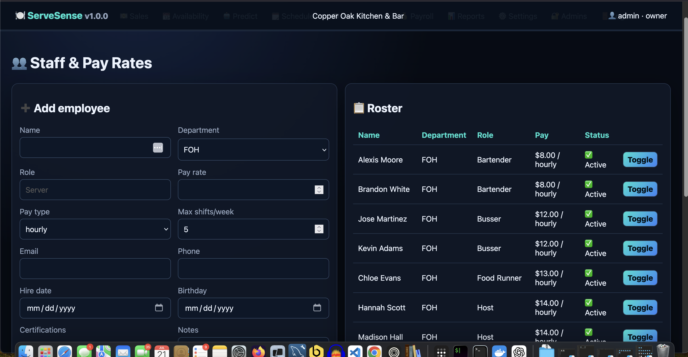
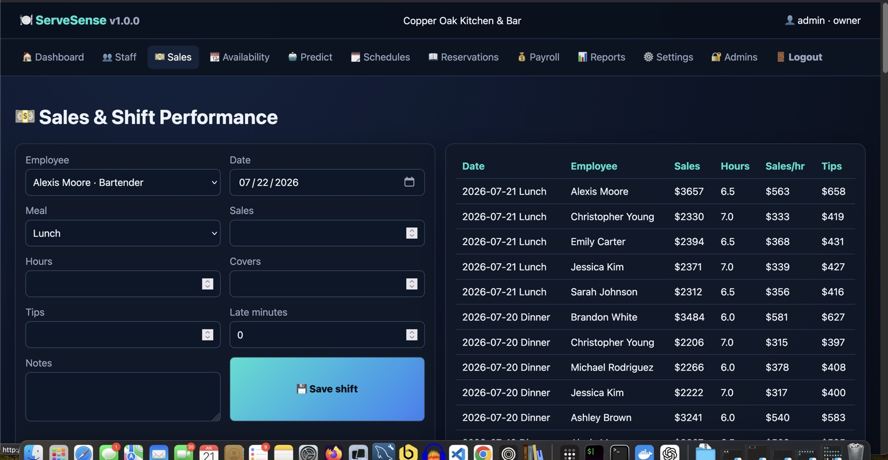
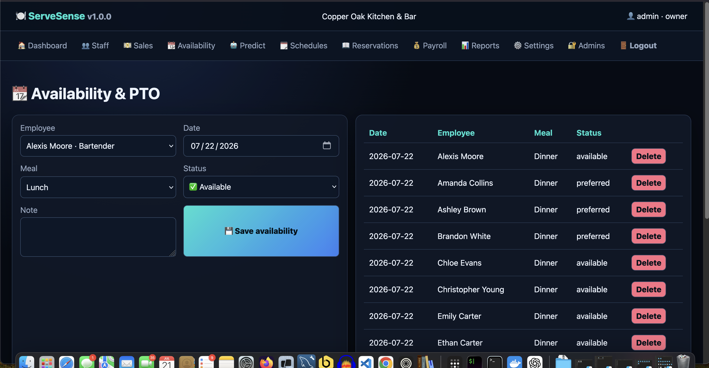
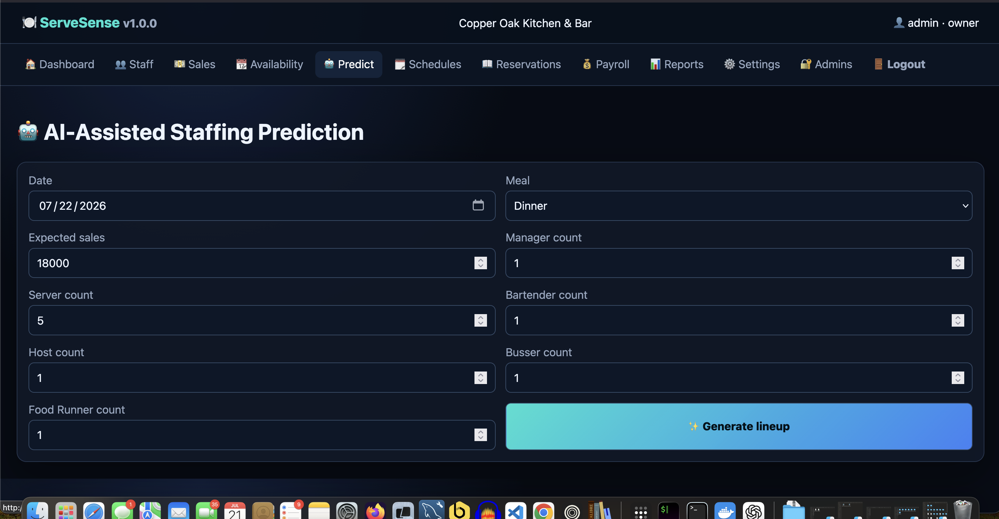
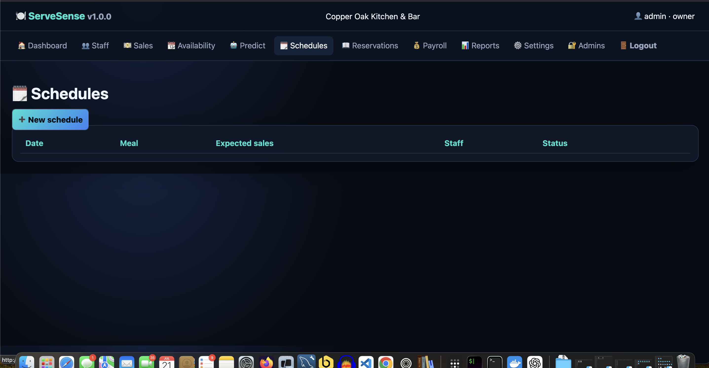
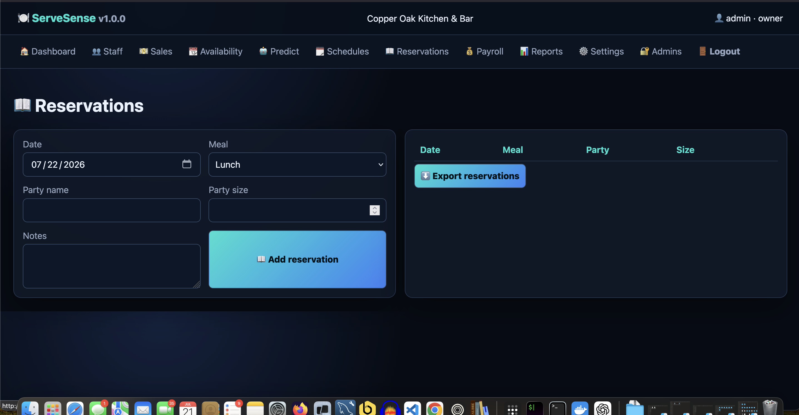
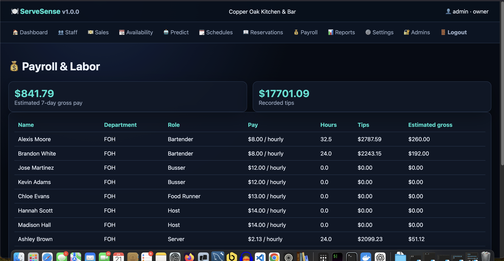
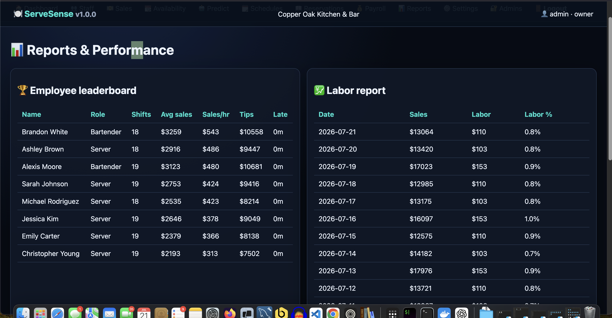
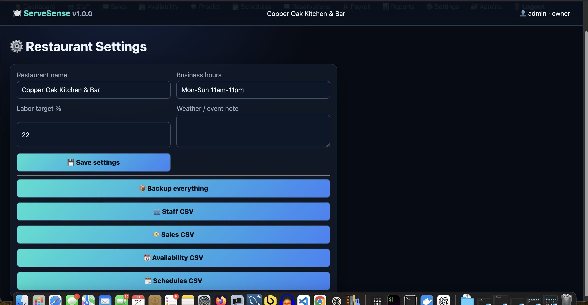
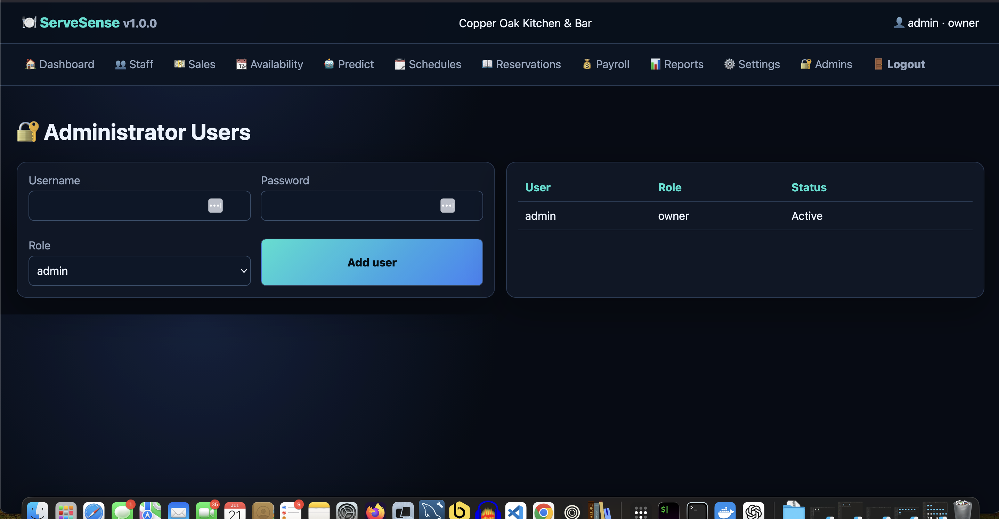

# ServeSense

ServeSense is a Dockerized Flask restaurant operations platform with staff/pay-rate management, sales tracking, availability/PTO, AI-assisted staffing recommendations, drag-and-drop scheduling, reports, multiple administrator accounts, CSV exports, and full database backups.

## Start

```bash
cp .env.example .env
docker compose up --build -d
```

Open `http://localhost:8003`.

Default demo credentials from `.env.example`:

- Username: `owner`
- Password: `ServeSenseDemo123!`

Change these before public deployment.

## Demo workflow

1. Sign in.
2. Click **Load demo data** on the dashboard.
3. Open **Predict** and generate a recommended lineup.
4. Save it into the schedule builder.
5. Drag employees between the roster and position lanes.
6. Publish the schedule.
7. Review Reports and export data from Settings.

## Included modules

- Dashboard KPIs and leaderboards
- Staff profiles, roles, pay rates, certifications, and status
- Sales, hours, covers, tips, lateness, and performance metrics
- Availability, preferences, PTO, and exclusions
- Explainable prediction scoring
- Drag-and-drop schedule builder with autosave
- Published/draft schedules
- Reservations and party-size tracking
- Payroll and seven-day labor estimates
- Labor percentage and employee performance reports
- Owner/admin/manager accounts
- Restaurant settings
- Staff, sales, availability, schedule, and admin CSV exports
- Complete ZIP backup with SQLite database

## Screenshots

### Staff and pay rates


### Sales and shift performance


### Availability and PTO


### AI-assisted staffing prediction


### Schedules


### Reservations


### Payroll and labor


### Reports and performance


### Restaurant settings


### Administrator users

